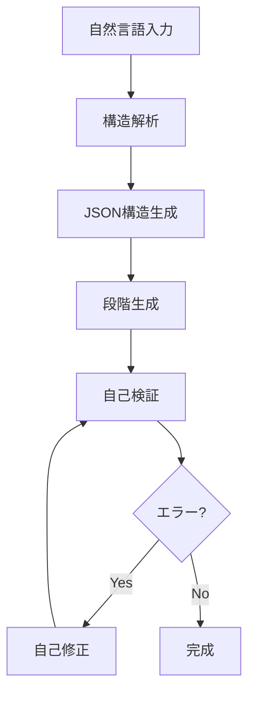

# MATURA 自律生成パイプライン設計書

## 📋 概要
MATURAは自然言語入力から完全に動作するNext.jsアプリケーションを自律生成するシステムです。

## 🔄 全体フロー



## 📊 段階生成フロー

### 1️⃣ Phase 1: 構造解析
```json
{
  "phase": "structure",
  "input": "ユーザーの自然言語要件",
  "output": {
    "appType": "string",
    "features": ["feature1", "feature2"],
    "pages": {
      "main": {
        "route": "/",
        "components": ["Hero", "Features", "CTA"]
      }
    },
    "state": {
      "entities": ["user", "products"],
      "actions": ["fetchData", "updateItem"]
    },
    "apis": {
      "routes": ["/api/items", "/api/auth"],
      "methods": ["GET", "POST", "PUT", "DELETE"]
    },
    "packages": ["next", "react", "tailwindcss", "shadcn-ui", "zustand"]
  }
}
```

### 2️⃣ Phase 2: UI生成
```json
{
  "phase": "ui",
  "input": "構造JSON + Figmaテンプレート",
  "templates": {
    "hero": "shadcn-hero-gradient",
    "features": "shadcn-feature-cards",
    "forms": "shadcn-form-modern"
  },
  "output": "/app/generated-app/components/"
}
```

### 3️⃣ Phase 3: 状態管理生成
```json
{
  "phase": "state",
  "input": "エンティティ定義",
  "stateManager": "zustand",
  "output": "/app/generated-app/store/"
}
```

### 4️⃣ Phase 4: API生成
```json
{
  "phase": "api",
  "input": "APIルート定義",
  "mockData": true,
  "output": "/app/api/generated/"
}
```

### 5️⃣ Phase 5: 統合・検証
```json
{
  "phase": "integration",
  "validation": {
    "lint": "eslint --fix",
    "typecheck": "tsc --noEmit",
    "format": "prettier --write"
  }
}
```

## 🤖 GPT Function Calling スキーマ

```typescript
const structureSchema = {
  name: "generateAppStructure",
  description: "自然言語からアプリ構造を生成",
  parameters: {
    type: "object",
    properties: {
      userInput: { type: "string" },
      appType: { 
        type: "string",
        enum: ["landing", "dashboard", "ecommerce", "blog", "saas", "portfolio"]
      },
      features: {
        type: "array",
        items: { type: "string" }
      },
      complexity: {
        type: "string",
        enum: ["simple", "medium", "complex"]
      }
    }
  }
}
```

## 🎨 Figmaテンプレート連携

```typescript
interface FigmaTemplate {
  id: string
  name: string
  components: {
    hero: FigmaComponent
    navigation: FigmaComponent
    features: FigmaComponent
    testimonials: FigmaComponent
    pricing: FigmaComponent
    footer: FigmaComponent
  }
  colorScheme: ColorPalette
  typography: TypographySystem
}
```

## 🔧 自己修正フロー

```typescript
interface SelfHealingFlow {
  maxRetries: 3
  strategies: [
    {
      error: "TypeScriptError",
      action: "fixTypeErrors",
      prompt: "Fix the following TypeScript errors..."
    },
    {
      error: "ImportError", 
      action: "resolveImports",
      prompt: "Resolve missing imports..."
    },
    {
      error: "SyntaxError",
      action: "fixSyntax",
      prompt: "Fix JavaScript/JSX syntax errors..."
    }
  ]
}
```

## 📁 出力ディレクトリ構造

```
/app/generated-app/
├── page.tsx              # メインページ
├── layout.tsx            # レイアウト
├── components/           # UIコンポーネント
│   ├── ui/              # shadcn/ui
│   └── custom/          # カスタムコンポーネント
├── store/               # 状態管理
│   └── index.ts         # Zustand store
├── hooks/               # カスタムフック
├── lib/                 # ユーティリティ
└── types/               # TypeScript型定義
```

## 🚀 実行フロー

1. **入力受付**
   ```bash
   npm run matura:generate "タスク管理アプリを作って"
   ```

2. **構造解析**
   - GPT-4 Turbo function calling で構造JSON生成
   - 必要なパッケージリスト作成

3. **段階生成**
   - UI → State → API → Integration の順で生成
   - 各段階で検証実行

4. **自己修正**
   - エラー検出時は自動で修正プロンプト発行
   - 最大3回まで再試行

5. **完成**
   ```bash
   cd app/generated-app && npm run dev
   ```

## ⚙️ 設定ファイル

### `matura.config.json`
```json
{
  "generation": {
    "model": "gpt-4-turbo",
    "temperature": 0.7,
    "maxTokens": 4096
  },
  "validation": {
    "enableLint": true,
    "enableTypeCheck": true,
    "autoFix": true
  },
  "output": {
    "directory": "/app/generated-app",
    "overwrite": true
  }
}
```

## 📝 プロンプトテンプレート

### UI生成プロンプト
```
You are a Next.js UI generator. Generate a ${componentType} component using:
- shadcn/ui components
- Tailwind CSS
- TypeScript
- Responsive design
- Accessibility best practices

Component requirements:
${requirements}

Figma reference:
${figmaTemplate}

Output only the component code without explanations.
```

### 状態管理生成プロンプト
```
Generate a Zustand store for managing:
${entities}

Include:
- TypeScript interfaces
- CRUD operations
- Async actions
- Error handling

Output only the store code.
```

## 🔄 継続的改善

1. **生成ログ収集**
   - 成功/失敗パターンを記録
   - プロンプト改善に活用

2. **テンプレート拡張**
   - ユーザーフィードバックから新テンプレート追加
   - Figmaテンプレートライブラリ拡充

3. **パフォーマンス最適化**
   - 並列生成の実装
   - キャッシュ活用

## 📚 実装スクリプト

生成スクリプトは `/scripts/matura/` に配置：

- `generateStructure.ts` - GPT-4による構造解析
- `generateUI.ts` - Geminiによるコンポーネント生成
- `generateState.ts` - 状態管理生成
- `generateApi.ts` - API生成
- `matura.ts` - 統合実行スクリプト

## 🎯 実行例

```bash
# シンプルな例
npx tsx scripts/matura/matura.ts "タスク管理アプリ"

# 詳細な要件
npx tsx scripts/matura/matura.ts "ECサイトを作って。商品一覧、カート機能、決済画面、ユーザー認証付き"

# Figma連携
npx tsx scripts/matura/matura.ts "ランディングページ" --figma="https://figma.com/file/xxx"
```

## ✨ 特徴

- **完全自律** - ユーザー確認なしで完成まで
- **自己修正** - エラーを検出して自動修復
- **高品質** - shadcn/ui使用で美しいUI
- **即実行可能** - `npm run dev`で即起動
- **拡張可能** - テンプレート追加が容易